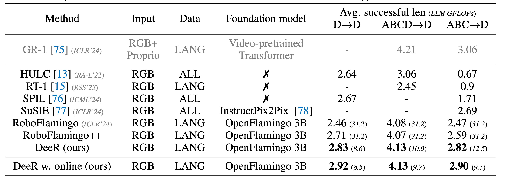
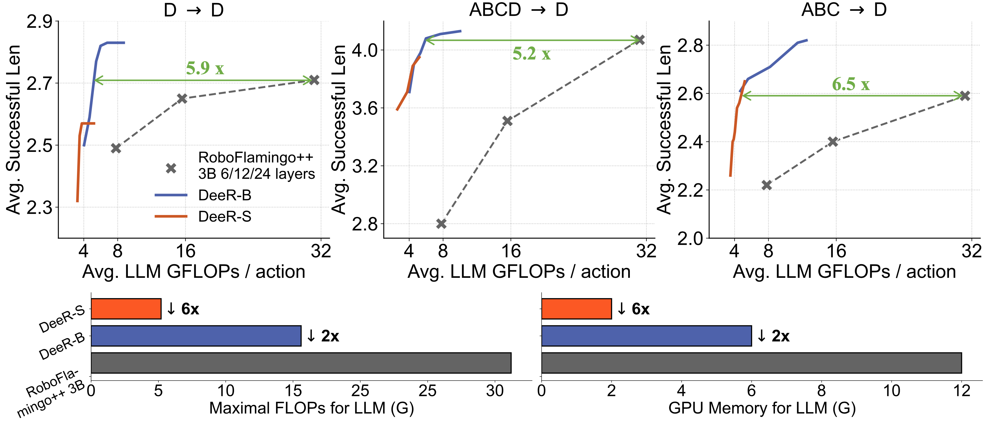

<!-- markdownlint-disable first-line-h1 -->
<!-- markdownlint-disable html -->

<div align="center">
  
</div>

<h1 align="center">DeeR-VLA: Dynamic Inference of Multimodal Large Language Models for Efficient Robot Execution</h1>


<p align="center">
    <a href="http://yueyang130.github.io/">Yang Yue<sup>1</sup></a> &emsp;
    <a href="https://www.wyl.cool/">Yulin Wang<sup>1</sup></a> &emsp;
    <a href="https://bingykang.github.io/">Bingyi Kang<sup>2</sup></a> &emsp;
    <a href="https://yizenghan.top/">Yizeng Han<sup>1</sup></a> &emsp;
    <a href="https://shenzhi-wang.netlify.app/">Shenzhi Wang<sup>1</sup></a> &emsp;
    <a href="https://scholar.google.com/citations?user=rw6vWdcAAAAJ&hl=zh-TW">Shiji Song<sup>1</sup></a> &emsp;
    <a href="https://sites.google.com/site/jshfeng/">Jiashi Feng<sup>2</sup></a> &emsp;
    <a href="https://www.gaohuang.net/">Gao Huang<sup>1</sup></a>
</p>
<p align="center">
    <sup>1</sup>Tsinghua University &emsp;
    <sup>2</sup>ByteDance Research
</p>


[](https://arxiv.org/pdf/2411.02359)
[](https://huggingface.co/Yang130/DeeR-VLA/tree/main)

<!-- <p align="center">
  <a href="#installation">Installation</a> •
  <a href="#pretrained-models">Pre-trained Models</a> •
  <a href="#dynamic-inference">Dynamic Inference</a> •
  <a href="#training">Training</a>
</p> -->


## Overview


This is also the official code repository for the paper [DeeR-VLA](https://arxiv.org/pdf/2411.02359).

DeeR-VLA is a framework for dynamic inference of multimodal large language models (MLLMs) designed specifically for efficient robot execution. Developing MLLMs for real-world robots is challenging due to the typically limited computation and memory capacities available on robotic platforms. DeeR-VLA addresses this challenge by implementing a Dynamic Early-Exit strategy that automatically adjusts the size of the activated MLLM based on the complexity of each situation. This approach leverages a multi-exit architecture, allowing the model to terminate processing once an appropriate size has been activated, thus avoiding redundant computation. DeeR-VLA also incorporates novel algorithms to establish early-termination criteria based on predefined demands such as average computational cost, peak computational consumption, and GPU memory usage. On the CALVIN robot manipulation benchmark, DeeR demonstrates significant reductions in computational costs of LLM by 5.2-6.5x and GPU memory of LLM by 2-6x without compromising performance. 

### Performance on CALVIN Benchmark

<div align="center">
  
</div>
<div align="center">
  
</div>

## Installation

1. Install [CALVIN](https://github.com/mees/calvin) simulator in your python environment following the instructions. Then download dataset `D`, `ABC`, and `ABCD`.  

2. Clone DeeR-VLA:
```bash
git clone https://github.com/your-username/DeeR-VLA.git
cd DeeR-VLA
```

3. Install dependencies in virtual environment:
```bash
pip install -r requirements.txt
```
4. Download the following models from Hugging Face. The OpenFlamingo framework is built on the MPT language model:
   - OpenFlamingo-3B-vitl-mpt1b-langinstruct: [OpenFlamingo-3B](https://huggingface.co/openflamingo/OpenFlamingo-3B-vitl-mpt1b-langinstruct)
   - MPT-1B-instruct: [MPT-1B](https://huggingface.co/mosaicml/mpt-1b-redpajama-200b-dolly)
  
    For optional 9B experiments, download:
   - OpenFlamingo-9B-vitl-mpt7b: [OpenFlamingo-9B](https://huggingface.co/openflamingo/OpenFlamingo-9B-vitl-mpt7b)
   - MPT-7B: [MPT-7B](https://huggingface.co/mosaicml/mpt-7b)

    Next, update the path variables in the `mpt_dict` dictionary located in `robot_flamingo/models/factory.py`:
   - Replace `lang_encoder_path` and `tokenizer_path` with your local paths for each pretrained MPT directory.
   - Update `$openflamingo_checkpoint` with the path to your OpenFlamingo `.pt` file.

6. Replace the standard LLM Transformer model definition files with early-exit ones by running the following commands:
  ```bash
    cp mosaic_gpt_3b.py ${MPT-1B-INSTRUCT_DIR}/mosaic_gpt.py
    cp modeling_gpt_9b.py ${MPT-7B_DIR}/modeling_gpt.py
  ```

### Common Errors

- For the error: module 'numpy' has no attribute 'float', run:
  ```bash
  pip install 'numpy==1.23'
  ```

- For the error "ImportError: cannot import name 'gcd' from 'fractions' (/usr/lib/python3.9/fractions.py)", run:
  ```bash
  pip install --upgrade networkx
  ```


## Dynamic Inference with Pretrained Models

### 1. Download Models
Download pretrained models from Huggingface [Yang130/DeeR-VLA](https://huggingface.co/Yang130/DeeR-VLA/tree/main)

- Task D model: `DeeR_task_D_D-exit-strategy`
- Tasks ABC model: `DeeR_task_ABC_D-exit-strategy`
- Tasks ABCD model: `DeeR_task_ABCD_D-exit-strategy`
- 9B Task D model: `DeeR_9B_task_D_D-exit-strategy`

### 2. Execute with Demonstration Dataset Thresholds. 

To reproduce the results presented in Table 2 of the paper for `DeeR (ours)`, execute the commands below. The average exit and successful length are logged at the end of the log file. The average GFLOPs can be obtained as described in Appendix A.2 of the paper.

```bash
# D 
python3 eval_ckpts.py --ckpt_dir DeeR_task_D_D-exit-strategy \
        --node_num 8 --amp 1 --exit_ratio 0.8 --num_seq 224 --max_layer 12

# ABC
python3 eval_ckpts.py --ckpt_dir DeeR_task_ABC_D-exit-strategy \
        --node_num 8 --amp 1 --exit_ratio 1.5 --num_seq 224 --max_layer 12

# ABCD
python3 eval_ckpts.py --ckpt_dir DeeR_task_ABCD_D-exit-strategy \
        --node_num 8 --amp 1 --exit_ratio 1.0 --num_seq 224 --max_layer 12
```

- `max_layer`: The maximum number of layers used for inference. For the 3B model with 24 layers, `12` corresponds to DeeR-B, while `4` corresponds to DeeR-S. For the 9B model, `12` is for DeeR-B and `8` is for DeeR-S. Reducing this value results in lower GPU memory usage and maximum GFLOPs.
- `node_num`: Indicates the number of threads and GPUs utilized for parallel evaluation.
- `num_seq`: The number of task chains for evaluation, defaulting to 224. You can set it to 1000 for a more comprehensive evaluation. Using 8 V100 GPUs takes approximately 4-5 hours for 1000 evaluations.
- `exit_ratio`: Determines the fraction of samples that exit at different stages. Lowering this value leads to a higher number of samples exiting earlier, resulting in less computation cost. The curves shown in Fig. 3 and 4 in our paper are generated by modifying this parameter and getting the average GFLOPs and successful lengths at various points.


### 3. Execute with Online Interaction Thresholds
First set:
```
# set parallel GPU
export ARNOLD_WORKER_GPU=8
export calvin_dataset_path='YOUR_PATH/calvin/dataset/task_D_D'
export calvin_conf_path="YOUR_PATH/calvin/calvin_models/conf"
```
You can run with optimized thresholds obtained through Bayesian optimization to reproduce the results presented in Table 2 of the paper for `DeeR (online)`.
```bash
# D 
export evaluate_from_checkpoint="DeeR_task_D_D-exit-strategy/stg=post_4+5_layer_11_multie_intv=2_extrae_nodth_reg_aug_10_4_traj_cons_ws_12_mpt_dolly_3b_7.pth"
export thresholds="0.024131965307197703 0.0034394217427938887 0.00701889456063509 0.009184207905083895 0.0045967466905420615 100000.0"
export log_file='log_DeeR_task_D_D-exit-strategy/online_threshold_eval.log'

# ABC 
export evaluate_from_checkpoint="DeeR_task_ABC_D-exit-strategy/stg=post_4+1_layer_11_multie_intv=2_extrae_nodth_reg_aug_10_4_traj_cons_ws_12_mpt_dolly_3b_4.pth"
export thresholds="0.05618929907679558 0.003506983596128319 0.00584903010905957 0.006535238670344992 0.005207180260029222 100000.0"
export log_file='log_DeeR_task_ABC_D-exit-strategy/online_threshold_eval.log'

# ABCD 
export evaluate_from_checkpoint="DeeR_task_ABCD_D-exit-strategy/stg=post_3+1_layer_11_multie_intv=2_extrae_nodth_reg_mlpdrp=0.5_layerwise_lstmdrp=0.4_aug_10_4_traj_cons_ws_12_mpt_dolly_3b_3.pth"
export thresholds="0.03354664587378331 0.002466938924360549 0.006321195199122956 0.005748750398084137 0.007737060680985451 100000.0"
export log_file='log_DeeR_task_ABCD_D-exit-strategy/online_threshold_eval.log'

```

Then run:

```
torchrun --nnodes=1 --nproc_per_node=$ARNOLD_WORKER_GPU  --master_port=12348 robot_flamingo/eval/eval_calvin.py \
    --precision fp32 \
    --use_gripper \
    --run_name DeeR \
    --calvin_dataset $calvin_dataset_path \
    --cross_attn_every_n_layers 4 \
    --calvin_conf_path $calvin_conf_path \
    --amp 1 \
    --evaluate_from_checkpoint $evaluate_from_checkpoint \
    --thresholds $thresholds \
    --num_seq 224 \
    --validation_set \
    --workers 1 > $log_file 2>&1

```

### 4. Search Thresholds via Online Interaction

If you want to search for thresholds using Bayesian Optimization yourself, run the following command. Note that this may take a long time:
```bash
python3 bayesian_optimization.py --acq_func LCB --seed 0 --num_seq 224  --n_calls 20 --init_exit_ratio 0.82 --port 12345 \
    --evaluate_from_checkpoint DeeR_task_D_D-exit-strategy/stg=post_4+5_layer_11_multie_intv=2_extrae_nodth_reg_aug_10_4_traj_cons_ws_12_mpt_dolly_3b_7.pth

python3 bayesian_optimization.py --acq_func EI --seed 1 --num_seq 224  --n_calls 20 --init_exit_ratio 1.2 --port 12345 \
    --evaluate_from_checkpoint DeeR_task_ABC_D-exit-strategy/stg=post_4+1_layer_11_multie_intv=2_extrae_nodth_reg_aug_10_4_traj_cons_ws_12_mpt_dolly_3b_4.pth

python3 bayesian_optimization.py --acq_func EI --seed 1 --num_seq 224  --n_calls 20 --init_exit_ratio 1.0 --port 12345 \
    --evaluate_from_checkpoint DeeR_task_ABCD_D-exit-strategy/stg=post_3+1_layer_11_multie_intv=2_extrae_nodth_reg_mlpdrp=0.5_layerwise_lstmdrp=0.4_aug_10_4_traj_cons_ws_12_mpt_dolly_3b_3.pth

```

## Training

Train based on 3B model for task D->D. Multi-node parallel training is also supported, offering faster training.:
```
torchrun --nnodes=1 --nproc_per_node=8 --master_port=6046 robot_flamingo/train/train_calvin_post_strategy.py \
    --report_to_wandb \
    --llm_name mpt_dolly_3b \
    --traj_cons \
    --use_gripper \
    --from_scratch \
    --run_name DeeR_task_D_D-exit-strategy \
    --calvin_dataset /YOUR_PATH/calvin/dataset/task_D_D \
    --dataset_resampled \
    --window_size 12 \
    --workers 1 \
    --batch_size_calvin 4 \
    --num_joint_epochs 4 --num_exit_epochs 4  \
    --exit_warmup_steps 2500 --joint_warmup_steps 2500 \
    --joint_lr_scheduler constant --exit_lr_scheduler constant  \
    --joint_learning_rate 1e-4 --exit_lr_scale 0.25 \
    --exit_learning_rate 2.5e-5  \
    --early_exit_layer 11 \
    --precision amp \
    --multi_exit
```
For task ABC->D:
```
# ABC
torchrun --nnodes=1 --nproc_per_node=8 --master_port=6046 robot_flamingo/train/train_calvin_post_strategy.py \
    --report_to_wandb \
    --llm_name mpt_dolly_3b \
    --traj_cons \
    --use_gripper \
    --from_scratch \
    --run_name DeeR_task_ABC_D-exit-strategy \
    --calvin_dataset /YOUR_PATH/calvin/dataset/task_ABC_D \
    --dataset_resampled \
    --window_size 12 \
    --workers 1 \
    --batch_size_calvin 4 \
    --num_joint_epochs 4 --num_exit_epochs 1  \
    --exit_warmup_steps 2500 --joint_warmup_steps 2500 \
    --joint_lr_scheduler constant --exit_lr_scheduler constant  \
    --joint_learning_rate 1e-4 --exit_lr_scale 0.25 \
    --exit_learning_rate 2.5e-5  \
    --early_exit_layer 11 \
    --precision amp \
    --multi_exit
```
For task ABCD->D:
```
# 
# First jointly train VLM and action head
torchrun --nnodes=1 --nproc_per_node=8 --master_port=6046 robot_flamingo/train/train_calvin_post_strategy.py \
    --report_to_wandb \
    --llm_name mpt_dolly_3b \
    --traj_cons \
    --use_gripper \
    --from_scratch \
    --run_name DeeR_task_ABCD_D-exit-strategy \
    --calvin_dataset /YOUR_PATH/calvin/dataset/task_ABCD_D \
    --dataset_resampled \
    --window_size 12 \
    --workers 1 \
    --batch_size_calvin 4 \
    --num_joint_epochs 3 --num_exit_epochs 0  \
    --exit_warmup_steps 2500 --joint_warmup_steps 2500 \
    --joint_lr_scheduler constant --exit_lr_scheduler constant  \
    --joint_learning_rate 1e-4 --exit_lr_scale 0.25 \
    --exit_learning_rate 2.5e-5  \
    --early_exit_layer 11 \
    --precision amp \
    --multi_exit

# (optional) post-train action head with slightly higher values for dropout with checkpoint from joint-train stage
torchrun --nnodes=1 --nproc_per_node=8 --master_port=6046 robot_flamingo/train/train_calvin_post_strategy.py \
    --report_to_wandb \
    --llm_name mpt_dolly_3b \
    --traj_cons \
    --use_gripper \
    --run_name DeeR_task_ABCD_D-exit-strategy \
    --calvin_dataset /YOUR_PATH/calvin/dataset/task_ABCD_D \
    --dataset_resampled \
    --window_size 12 \
    --workers 1 \
    --batch_size_calvin 4 \
    --num_joint_epochs 3 --num_exit_epochs 1  \
    --exit_warmup_steps 2500 --joint_warmup_steps 2500 \
    --joint_lr_scheduler constant --exit_lr_scheduler constant  \
    --joint_learning_rate 1e-4 --exit_lr_scale 0.25 \
    --exit_learning_rate 2.5e-5  \
    --early_exit_layer 11 \
    --precision amp \
    --multi_exit \
    --resume_from_checkpoint DeeR_task_ABCD_D-exit-strategy/stg=post_3+0_layer_11_multie_intv=2_mlpdrp=0.4_layerwise_lstmdrp=0.3_aug_10_4_traj_cons_ws_12_mpt_dolly_3b_2.pth  \
    --exit_dropout 0.5 \
    --lstm_dropout 0.4
```

Train based on 9B model for task D->D:
```
torchrun --nnodes=1 --nproc_per_node=8 --master_port=6047 robot_flamingo/train/train_calvin_post_strategy.py \
    --report_to_wandb \
    --llm_name mpt_9b \
    --traj_cons \
    --use_gripper \
    --from_scratch \
    --run_name DeeR_9B_task_D_D-exit-strategy \
    --calvin_dataset /YOUR_PATH/calvin/dataset/task_D_D \
    --dataset_resampled \
    --window_size 12 \
    --workers 1 \
    --batch_size_calvin 6 \
    --num_joint_epochs 4 --num_exit_epochs 4  \
    --exit_warmup_steps 2500 --joint_warmup_steps 2500 \
    --joint_lr_scheduler constant --exit_lr_scheduler constant  \
    --joint_learning_rate 1e-4 --exit_lr_scale 0.25 \
    --exit_learning_rate 2.5e-5  \
    --early_exit_layer 15 \
    --precision amp \
    --multi_exit
```

## Acknowledgments

This work builds upon several excellent open-source projects:

- [CALVIN](https://github.com/mees/calvin) - A benchmark for Language-Conditioned Policy Learning
- [OpenFlamingo](https://github.com/mlfoundations/open_flamingo) - An open-source framework for training large multimodal models
- [RoboFlamingo](https://github.com/RoboFlamingo/RoboFlamingo) - Vision-Language Foundation Models as Effective Robot Imitators

## Citation

```bibtex
@inproceedings{
DeeR-VLA,
title={DeeR-VLA: Dynamic Inference of Multimodal Large Language Models for Efficient Robot Execution},
author={Yue, Yang and Wang, Yulin and Kang, Bingyi and Han, Yizeng and Wang, Shenzhi and Song, Shiji and Feng, Jiashi and Huang, Gao},
booktitle={The Thirty-eighth Annual Conference on Neural Information Processing Systems},
year={2024},
}
```
